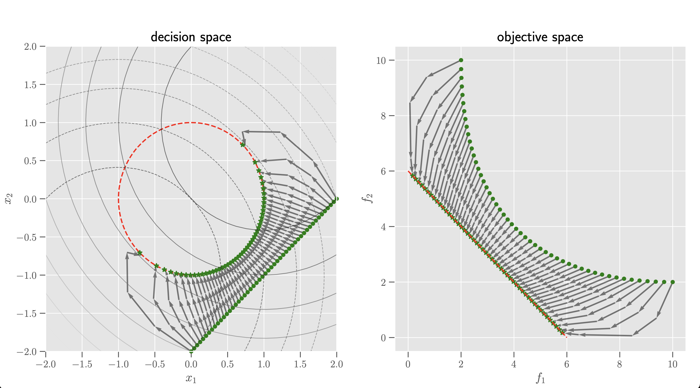
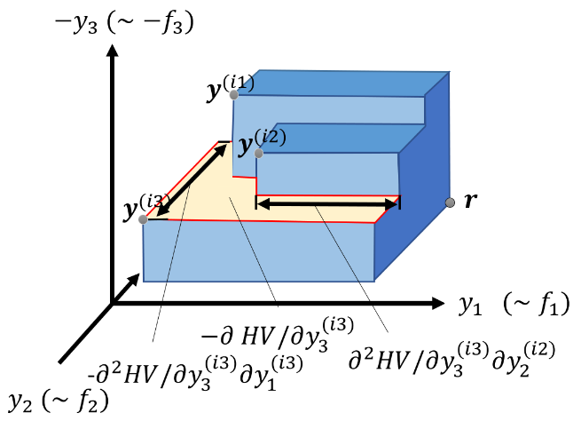

# Multi-objective Newton Methods

This package contains three set-oriented Newton methods for solving _constrainted continuous multiobjective optimization problems_:

* **What for?**
  * a **MMD-based Newton Method** (MMDN), which is submitted to _NeurIPS 2025 conference_.
  * a **$\Delta_p$ Newton Method** (DpN), which minimizes average Hausdorff distance, accepted in IEEE TEVC [WRU+24].
  * a **Hypervolume Newton Method** (HVN), which maximizes the Hypervolume indicator, accepted in IEEE TCYB and other venues [DEW22,SSW+22].
* **Why?**
  * the Newton method has a local **quadratic convergence** under some mild condition of objective functions.
  * Perhaps, you'd like to refine the final outcome of some direct optimizers with the Hypervolume Newton method..
* **When to use it?** the objective function is at least *twice continuously differentiable*.

Specifically, you will find the following major functionalities:

1. `hvd.mmd_newton.MMDNewton`: the MMD-based Newton method, submitted to NeurIPS 2025.
2. `hvd.DpN`: $\Delta_p$ Newton Method for (constrained) Multi-objective Optimization Problems in [[WRU+24]](https://arxiv.org/pdf/2405.05721).
3. `hvd.HypervolumeDerivatives`: the analytical computation of the HV Hessian and specifically, Alg. 2 described in [[DEW22]](https://arxiv.org/abs/2211.04171).
4. `hvd.HVN`: Hypervolume Newton Method for (constrained) Multi-objective Optimization Problems in [[WED+22]](https://www.preprints.org/manuscript/202211.0103/v1).

## References

* [[DEW22]](https://arxiv.org/abs/2211.04171) Deutz, A.; Emmerich, Michael T. M.; Wang, H. The Hypervolume Indicator Hessian Matrix: Analytical Expression, Computational Time Complexity, and Sparsity, _arXiv_, 2022.

* [[WRU+24]](https://arxiv.org/pdf/2405.05721) Wang, Hao, Angel E. Rodriguez-Fernandez, Lourdes Uribe, André Deutz, Oziel Cortés-Piña, and Oliver Schütze. "A Newton method for hausdorff approximations of the Pareto front within multi-objective evolutionary algorithms." IEEE Transactions on Evolutionary Computation (2024).

* [[SSW+22]](https://ieeexplore.ieee.org/document/8588401) Víctor Adrián Sosa-Hernández, Oliver Schütze, Hao Wang, André H. Deutz, Michael Emmerich. "The Set-Based Hypervolume Newton Method for Bi-Objective Optimization." IEEE Trans. Cybern. 50(5): 2186-2196 (2020)

## Installation

For now, please take the lastest version from the `neurips2025` branch:

```shell
git clone https://github.com/wangronin/HypervolumeDerivatives.git
cd HypervolumeDerivatives && pip install -f requirements.txt
```

You can decide to use a Python virtual environment to install the dependencies.

## Reproducing NeurIPS 2025's results

The experimental data needed for running MMD-based Newton (MMDN) can be accessed via [`MMD_data.zip`](https://drive.google.com/file/d/1OwDs89y1ccGbBSxG-4qpbLxtgE7e9x5U/view?usp=sharing). Please download and unzip it before reproducing the experiments. After unzipping, you should have a `./MMD_data` folder containing CSV files of initial points and reference sets generated from multi-objective optimization evolutionary algorithms (MOEAs). See our experimental procedure in the submitted paper for details.

In the `/scripts` folder, you can find the experimental scripts for our NeurIPS 2025 submission: `/scripts/benchmark_MMD.py` performs the experiments in Sec. 6 of the paper. Calling signature is:

```shell
python ./scripts/benchmark_MMD.py ZDT1
```

`ZDT1` is one of the test problem we had in the experiments among `ZDT1, ZDT2, ZDT3, ZDT4, DTLZ1, DTLZ2, DTLZ3, DTLZ4, DTLZ1, DTLZ6, DTLZ7`. This script will run in parallel by default and save a CSV and LaTeX table for the results in the `./result` folder.

The baseline MOEAs should be executed with the folllowing command:

```shell
python ./scripts/benchmark_EA.py ZDT1
```

This script will run in parallel by default and save a CSV and LaTeX table for the results in the `./result` folder. After benchmarking both MMDN and MOEAs on each test problems. The statistical summary/hypothesis testing is performed by running

```shell
python ./scripts/compute_statistics_MMD.py
```

which take the raw data stored in `./.results` and perform Mann-Whitney U test with multiple testing corrections. The test results are save in files named `MMD-300.txt` and `MMD-300.tex`.


## Example run of the HVN method on the simple MOP1 problem




## Hypervolume Hessian Matrix

Hypervolume (HV) Indicator of a point set $Y\subset\mathbb{R}^m$ computes the Lebesgue measure of the subset of $\mathbb{R}^m$ that is dominated by $Y$. HV is **Pareto compliant** and often used as a quality indicator in Evolutionary Multi-objective Optimization Algorithms (EMOAs), e.g., SMS-EMOA. Since maximizing HV w.r.t. the point set $S$ will lead to finite approximations to the (local) Pareto front, HV can also be used to guide the multi-objective search.

Consider an objective function $F:\mathbb{R}^d \rightarrow \mathbb{R}^m$, subject to minimization and a point set $X\subset \mathbb{R}^d$ of cardinality $n$. We care about the fast, analytical computation of the following quantity:
$$\frac{\partial^2 HV(F(X))}{\partial X \partial X^\top},$$
which is a $nd \times nd$-matrix. The implementation works for multi- and many-objective cases.

### Example

```Python
import numpy as np
from hvd import HypervolumeDerivatives
from hvd.newton import HVN

# Compute the HV Hessian w.r.t. the objective points
ref = np.array([9, 10, 12])
hvh = HypervolumeDerivatives(3, 3, ref, minimization=True)
out = hvh.compute_derivatives(X=np.array([[5, 3, 7], [2, 1, 10]]), compute_hessian=True)

# Define constants for the objective space
c1 = np.array([1.5, 0, np.sqrt(3) / 3])
c2 = np.array([1.5, 0.5, -np.sqrt(3) / 6])
c3 = np.array([1.5, -0.5, -np.sqrt(3) / 6])
ref = np.array([24, 24, 24])

# Define the objective function and its derivatives
def MOP1(x):
    x = np.array(x)
    return np.array(
        [
            np.sum((x - c1) ** 2),
            np.sum((x - c2) ** 2),
            np.sum((x - c3) ** 2),
        ]
    )

def MOP1_Jacobian(x):
    x = np.array(x)
    return np.array(
        [
            2 * (x - c1),
            2 * (x - c2),
            2 * (x - c3),
        ]
    )

def MOP1_Hessian(x):
    return np.array([2 * np.eye(3), 2 * np.eye(3), 2 * np.eye(3)])

# Compute the HV Hessian w.r.t. the decision points
hvh = HypervolumeDerivatives(
    n_var=3, n_obj=3, ref=ref, func=MOP1, jac=MOP1_Jacobian, hessian=MOP1_Hessian
)

w = np.random.rand(20, 3)
w /= np.sum(w, axis=1).reshape(-1, 1)
X = w @ np.vstack([c1, c2, c3])
out = hvh.compute(X)

# Hypervolume Newton Method
max_iters = 10
mu = 20
ref = np.array([20, 20, 20])
w = np.abs(np.random.rand(mu, 3))
w /= np.sum(w, axis=1).reshape(-1, 1)
x0 = w @ np.vstack([c1, c2, c3])

opt = HVN(
    n_var=3,
    n_obj=3,
    ref=ref,
    func=MOP1,
    jac=MOP1_Jacobian,
    hessian=MOP1_Hessian,
    X0=x0,
    xl=np.full(3, -2),
    xu=np.full(3, 2),
    max_iters=max_iters,
    verbose=True,
)

X, Y, stop = opt.run()
```

## Brief Explanation of the Analytical Computation

The **hypervolume indicator** (HV) of a set of points is the m-dimensional Lebesgue measure of the space that is jointly dominated by a set of objective function vectors in $\mathbb{R}^m$ and bound from above by a reference point. HV is widely investigated in solving _multi-objective optimization problems_ (MOPs), where it is often used as a performance indicator for assessing the quality of _Evolutionay Multi-objective Optimization Algorithms_ (EMOAs), or employed to solve MOPs directly, e.g., [Hypervolume Indicator Gradient Algorithm](https://scholar.google.com/citations?view_op=view_citation&hl=en&user=Pz9c6XwAAAAJ&citation_for_view=Pz9c6XwAAAAJ:5nxA0vEk-isC) and [Hypervolume Indicator Netwon Method](https://scholar.google.com/citations?view_op=view_citation&hl=en&user=Pz9c6XwAAAAJ&citation_for_view=Pz9c6XwAAAAJ:QIV2ME_5wuYC).

We show an example of 3D hypervolume indicator and the geometrical meaning of its partial derivatives as follows.



In this chart, we have three objective function to minimize, where we depicts three objective points, $y^{(i1)}, y^{(i2)}, y^{(i3)}$. The hypervolume (HV)indicator value, in this case, is the volume of the 3D ortho-convex polygon (in blue) - the subset dominated by $y^{(i1)}, y^{(i2)}, y^{(i3)}$. The first-order partial derivative of HV, for instance, $\partial HV/\partial y_3^{(i3)}$ is the yellow-colored 2D facet. The second-order partial derivative of HV, e.g., $\partial^2 HV/\partial y_3^{(i3)} \partial y_2^{(i2)}$ is an edge of the polygon.

## Symbolic computation of the Hessian in Mathematica

Also, we include, in folder `mathematica/`, several cases of the hypervolume indicator Hessian computed symoblically using `Mathematica`.