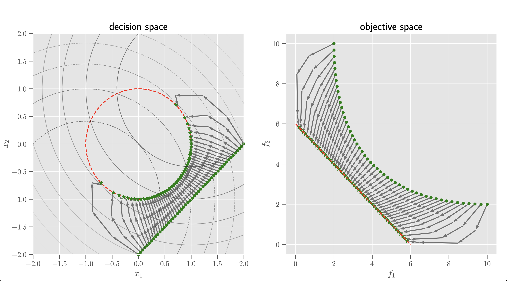
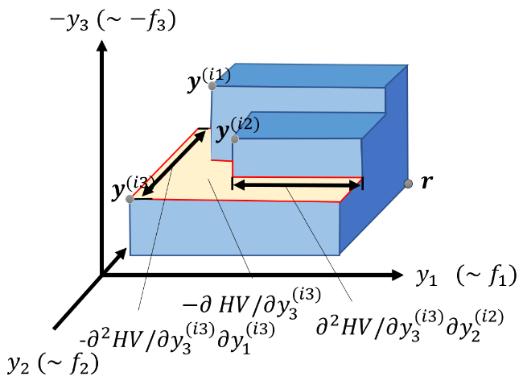

# Hypervolume Indicator Derivatives

* **What for?**
  * a **Hypervolume Newton Method** for solving _continuous multiobjective optimization problems_ (MOPs),
  * enabled by the analytically computation of **Hypervolume Hessian Matrix**.
* **Why?**
  * the Newton method has a local **quadratic convergence** under some mild condition of objective functions.
  * Perhaps, you'd like to refine the final outcome of some direct optimizers with the Hypervolume Newton method..
* **When to use it?** the objective function is at least *twice continuously differentiable*.



Specifically, you will find the following major functionalities:

1. `hvd.HypervolumeDerivatives`: the analytical computation of the HV Hessian and specifically, Alg. 2 described in [[DEW22]](https://arxiv.org/abs/2211.04171).
2. `hvd.HVN`: Hypervolume Newton Method for (Constrained) Multi-objective Optimization Problems in [[WED+22]](https://www.preprints.org/manuscript/202211.0103/v1).

## Installation

<!-- You could either install the stable version on `pypi`: -->
A `pypi` package will be available soon:
<!-- ```shell
pip install hvd
``` -->

For now, please take the lastest version from the master branch:

```shell
git clone https://github.com/wangronin/HypervolumeDerivatives.git
cd HypervolumeDerivatives && python setup.py install --user
```

## Hypervolume Hessian Matrix

Hypervolume (HV) Indicator of a point set $Y\subset\mathbb{R}^m$ computes the Lebesgue measure of the subset of $\mathbb{R}^m$ that is dominated by $Y$. HV is **Pareto compliant** and often used as a quality indicator in Evolutionary Multi-objective Optimization Algorithms (EMOAs), e.g., SMS-EMOA. Since maximizing HV w.r.t. the point set $S$ will lead to finite approximations to the (local) Pareto front, HV can also be used to guide the multi-objective search.

Consider an objective function $F:\mathbb{R}^d \rightarrow \mathbb{R}^m$, subject to minimization and a point set $X\subset \mathbb{R}^d$ of cardinality $n$. We care about the fast, analytical computation of the following quantity:
$$\frac{\partial^2 HV(F(X))}{\partial X \partial X^\top},$$
which is a $nd \times nd$-matrix. The implementation works for multi- and many-objective cases.

### Example

```Python
import numpy as np
from hvd import HypervolumeDerivatives
from hvd.newton import HVN

# Compute the HV Hessian w.r.t. the objective points
ref = np.array([9, 10, 12])
hvh = HypervolumeDerivatives(3, 3, ref, minimization=True)
out = hvh.compute_derivatives(X=np.array([[5, 3, 7], [2, 1, 10]]), compute_hessian=True)

# Define constants for the objective space
c1 = np.array([1.5, 0, np.sqrt(3) / 3])
c2 = np.array([1.5, 0.5, -np.sqrt(3) / 6])
c3 = np.array([1.5, -0.5, -np.sqrt(3) / 6])
ref = np.array([24, 24, 24])

# Accept either one point or a population in the objective and its derivatives.
def MOP1(x):
    x = np.array(x)
    return np.stack(
        [
            np.sum((x - c1) ** 2, axis=-1),
            np.sum((x - c2) ** 2, axis=-1),
            np.sum((x - c3) ** 2, axis=-1),
        ],
        axis=-1,
    )

def MOP1_Jacobian(x):
    x = np.array(x)
    return np.stack(
        [
            2 * (x - c1),
            2 * (x - c2),
            2 * (x - c3),
        ],
        axis=-2,
    )

def MOP1_Hessian(x):
    return np.broadcast_to(2 * np.eye(3), (*np.shape(x)[:-1], 3, 3, 3))

# Compute the HV Hessian w.r.t. the decision points
hvh = HypervolumeDerivatives(
    n_var=3, n_obj=3, ref=ref, func=MOP1, jac=MOP1_Jacobian, hessian=MOP1_Hessian
)

w = np.random.rand(20, 3)
w /= np.sum(w, axis=1).reshape(-1, 1)
X = w @ np.vstack([c1, c2, c3])
out = hvh.compute(X)

# Hypervolume Newton Method
max_iters = 10
mu = 20
ref = np.array([20, 20, 20])
w = np.abs(np.random.rand(mu, 3))
w /= np.sum(w, axis=1).reshape(-1, 1)
x0 = w @ np.vstack([c1, c2, c3])

opt = HVN(
    n_var=3,
    n_obj=3,
    ref=ref,
    func=MOP1,
    jac=MOP1_Jacobian,
    hessian=MOP1_Hessian,
    X0=x0,
    xl=np.full(3, -2),
    xu=np.full(3, 2),
    max_iters=max_iters,
    verbose=True,
)

X, Y, stop = opt.run()
```

## MMD kernels

The `hvd.mmd` package contains the vectorized indicators, kernels, and legacy
implementation. The Newton optimizer remains in `hvd.mmd_newton`.
Pass a configured kernel to `MMD` or `MMDMatching`:

```python
from hvd.mmd import MMD
from hvd.mmd.kernels import RBF, RationalQuadratic

kernel = RationalQuadratic(theta=0.7, alpha=1.3)
indicator = MMD(n_var=3, n_obj=3, ref=reference_set, kernel=kernel)
```

Kernel parameters belong to the kernel. Replace `MMD(..., theta=t)` with
`MMD(..., kernel=RBF(theta=t))`. `Laplace`
is also available in `hvd.mmd.kernels`. The existing `theta`
formulas are unchanged, so saved tuning configurations remain valid.
Kernels are immutable; create a new instance when changing parameters.
Each kernel owns its cached, JIT-compiled `gradient`, `hessian`, and
`mixed_hessian`, computed with `jacrev` and `jacfwd`. It also exposes
`diagonal`, `diagonal_gradient`, and `diagonal_hessian` for the function
`k(x, x)`. Population helpers provide all-pairs evaluation (`pairwise*`),
evaluation of already aligned pairs (`matched*`), and self-pair evaluation
(`diagonal*_batch`). Their docstrings specify pairing rules and output shapes.
MMD combines these kernel evaluations into indicator values and derivatives.
Subclasses can override the derivative functions with analytical formulas.
Custom JAX-compatible callables accepting `(x, y)` are supported through
the `CallableKernel` adapter, applied automatically by MMD.

Create the indicator before passing it to `MMDN`. The indicator owns its
reference set, objective callbacks, kernel, and any matching parameters:

```python
from hvd.mmd import MMDMatching
from hvd.mmd.kernels import RationalQuadratic
from hvd.mmd_newton import MMDN

indicator = MMDMatching(
    n_var=problem.n_var,
    n_obj=problem.n_obj,
    ref=reference_set,
    func=problem.objective,
    jac=problem.objective_jacobian,
    hessian=problem.objective_hessian,
    kernel=RationalQuadratic(theta=0.7, alpha=1.3),
    beta=0.25,
)
optimizer = MMDN(
    n_var=problem.n_var,
    n_obj=problem.n_obj,
    func=problem.objective,
    jac=problem.objective_jacobian,
    xl=problem.xl,
    xu=problem.xu,
    indicator=indicator,
)
```

The `indicator` argument is required. Use `MMD` instead of `MMDMatching` above
for ordinary MMD. `MMDN` does not create an indicator or accept `ref`,
`matching`, `beta`, `kernel`, or an objective `hessian`; configure these on
the indicator. Access or replace the reference through `indicator.ref`.
`MMDN` evaluates the indicator and decides when to request a reference shift:
initially, then when a point is near a reference target and its previous
Newton step is near zero. It calls `indicator.shift_reference_set(indices=...)`
for the selected points. Both indicators forward the shift to `ReferenceSet.shift`,
which controls how reference points or matched medoids move. The indicator
records target trajectories in `history_reference_set`.
During line searches, the optimizer uses the indicator's `trial_evaluation()`
context. `MMDMatching` keeps its matching fixed and always enables `re_match`
on exit, including when evaluation raises an exception; ordinary `MMD` needs
no temporary state change.

Native problem methods accept either a point `(n_var,)` or a population
`(N, n_var)`: use `problem.objective(X)` or `problem.eq_constraint(X)` for
either input shape. The same applies to Jacobians and Hessians. Population
results have a leading axis of size `N`; derivatives are computed per point.
These methods replace the separate public `*_batch` methods while retaining
cached `jit(vmap(...))` implementations. Constraint methods return `None` when
their constraint count is zero.
Custom callbacks passed to optimizers must follow the same point-or-population
convention: `State` passes the input directly to the callback.

## DpN benchmarks

`scripts/benchmark_DpN.py` is the common runner for CF1–CF10, ZDT1–ZDT4/ZDT6,
DTLZ1–DTLZ7, IDTLZ1–IDTLZ4, and CONV4_2F. It replaces the separate CF, CONV4,
DTLZ, and DpN2 benchmark scripts and follows the MMD runner's command-line
structure. DpN uses fixed IGD and Hessian regularization settings; no tuning
configuration is loaded.

```shell
python scripts/benchmark_DpN.py IDTLZ1 --n-jobs 15
python scripts/benchmark_DpN.py CF1 --algorithm SMS-EMOA --data-path data-reference/CF --max-iters 6
python scripts/benchmark_DpN.py CONV4_2F --data-path data-reference/CONV4_2F --generation 400
```

Defaults are NSGA-III, `mmd_data`, generation 300, and five Newton iterations.
The decision dimension comes from the stored population, and box bounds are
included as inequality constraints. Every discovered run is processed; the
old hard-coded run exclusions are removed, and execution errors propagate.
`--results-dir` receives a summary CSV with run IDs, HV, IGD, GD, Jacobian
counts, and wall-clock time in microseconds, plus initial/final objective
populations. `--plot-dir` receives one PDF per run, including parallel-coordinate
plots for four-objective problems.

## Brief Explanation of the Analytical Computation

The **hypervolume indicator** (HV) of a set of points is the m-dimensional Lebesgue measure of the space that is jointly dominated by a set of objective function vectors in $\mathbb{R}^m$ and bound from above by a reference point. HV is widely investigated in solving _multi-objective optimization problems_ (MOPs), where it is often used as a performance indicator for assessing the quality of _Evolutionay Multi-objective Optimization Algorithms_ (EMOAs), or employed to solve MOPs directly, e.g., [Hypervolume Indicator Gradient Algorithm](https://scholar.google.com/citations?view_op=view_citation&hl=en&user=Pz9c6XwAAAAJ&citation_for_view=Pz9c6XwAAAAJ:5nxA0vEk-isC) and [Hypervolume Indicator Netwon Method](https://scholar.google.com/citations?view_op=view_citation&hl=en&user=Pz9c6XwAAAAJ&citation_for_view=Pz9c6XwAAAAJ:QIV2ME_5wuYC).

We show an example of 3D hypervolume indicator and the geometrical meaning of its partial derivatives as follows.



In this chart, we have three objective function to minimize, where we depicts three objective points, $y^{(i1)}, y^{(i2)}, y^{(i3)}$. The hypervolume (HV)indicator value, in this case, is the volume of the 3D ortho-convex polygon (in blue) - the subset dominated by $y^{(i1)}, y^{(i2)}, y^{(i3)}$. The first-order partial derivative of HV, for instance, $\partial HV/\partial y_3^{(i3)}$ is the yellow-colored 2D facet. The second-order partial derivative of HV, e.g., $\partial^2 HV/\partial y_3^{(i3)} \partial y_2^{(i2)}$ is an edge of the polygon.

## Symbolic computation of the Hessian in Mathematica

Also, we include, in folder `mathematica/`, several cases of the hypervolume indicator Hessian computed symoblically using `Mathematica`.

## References

* [[WED+22]](https://www.preprints.org/manuscript/202211.0103/v1) Wang, H.; Emmerich, Michael T. M.; Deutz, A.; Hernández, V.A.S.; Schütze, O. The Hypervolume Newton Method for Constrained Multi-objective Optimization Problems. _Preprints_ **2022**, 2022110103.

* [[DEW22]](https://arxiv.org/abs/2211.04171) Deutz, A.; Emmerich, Michael T. M.; Wang, H. The Hypervolume Indicator Hessian Matrix: Analytical Expression, Computational Time Complexity, and Sparsity, _arXiv_, 2022.
